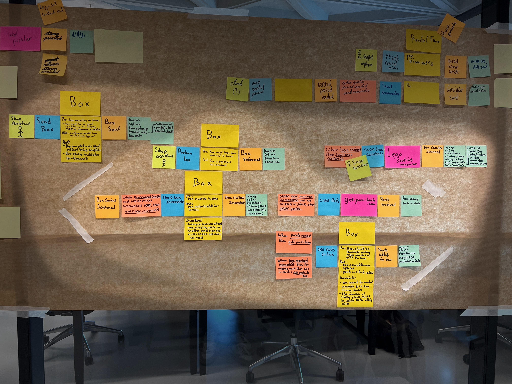
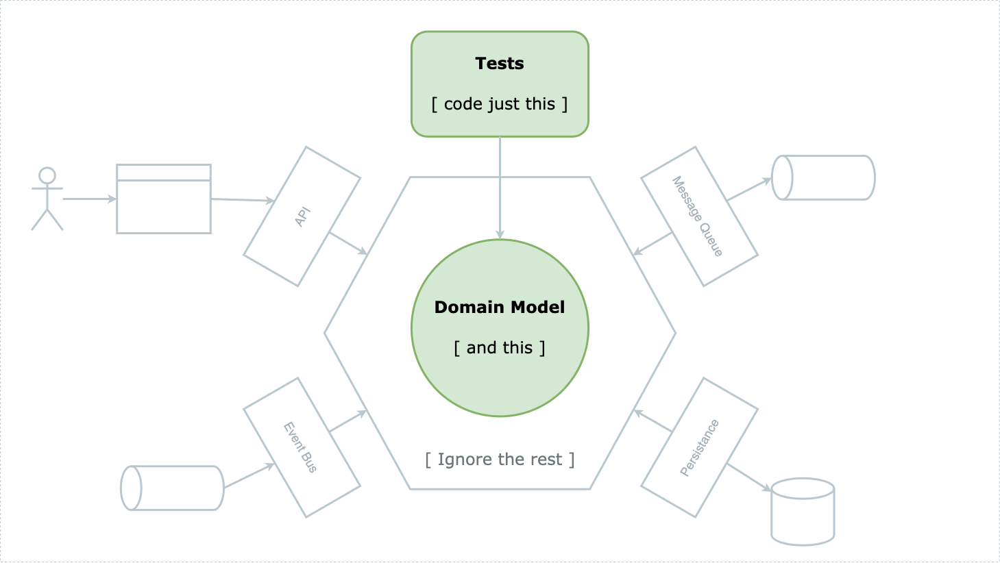

# Playing with Domain Models in Code

Two brains, one domain, one laptop, and a guarantee for 2 hours of fun and learning. You’ll go back to basics. Talking about the domain, designing the model and explore coding the model.

This is a [hands-on coding workshop](https://sessionize.com/s/nico-krijnen/playing-with-domain-models-in-code/68102) where you will work in pairs together with other participants. Your base will be the output of an EventStorming session and some context about the domain that you'll be modeling. Together, you'll play around, modeling parts of the domain in code, using tests to guide your design.

## The Domain


Did you ever rent a Lego set? It turns out this is big business. This assignment plays out in the domain of the fictitious company Lego4Rent, which specializes in renting out Lego sets. The mission of Lego4Rent is:

	"Your hobby is our passion"

Lego4Rent allows you to build even the most complex Lego sets without making a huge investment, just rent them for a small fee per week.

## A world of innovation

As you can imagine, one of the issues with renting out Lego is Lego pieces going missing. Checking every set manually is a tedious job, but luckily some recent developments might change that. Several people have created machines that automatically sort Lego using Machine Learning.

[](https://www.robotminor.nl/the-lego-sorter-bsl-bricks/)

[](https://youtu.be/04JkdHEX3Yk)

# Innovation at work

The plan is to start sorting all boxes fully automated when they are returned to the store, see the drawing below. At Lego4Rent, Lego sets are rented out not in their original box, but in a plastic storage box containing a number of zip-lock bags.


## Your input: an EventStorming output

Together with the Lego4Rent team, we have done a software-design **EventStorming** session to discover what happens in and around the system they use for their Lego rental operation. Especially the part dealing with incoming boxes and adding missing parts is interesting, now that we have an automated Lego sorter at our disposal.

Highlighted in the center are a number of flows for Lego **Boxes** that are rented out.

These flows typically start with:
- an <span style="color:#dedf4b">**actor** 🟨</span> or a <span style="color:#ff9362">**policy** 🟧🟧</span> that triggers
- a <span style="color:#26addc">**command** 🟦</span>
- against an <span style="color:#dedf4b">**aggregate constraint** 🟨🟨</span> or against an <span style="color:#ff49af">**external system** 🟪🟪</span>, both of which produce
- a <span style="color:#fec233">**domain event** 🟧</span> 
- with next to it the <span style="color:#a6d6bd">**read model** ⬜</span> data that is used by actors to decide what commands to trigger.

[](Lego4Rent_EventStorming.jpg)
[**Open photo larger**](Lego4Rent_EventStorming.jpg)

[What do the colors mean again?](https://raw.githubusercontent.com/ddd-crew/eventstorming-glossary-cheat-sheet/master/resources/software-picture.jpg)

## Your assignment

Pair up with someone else and **use TDD** red-green-refactor loop to flesh out the business logic for the aggregates that handle the various commands.

Regularly switch driver and navigator. For example using the [pair programming ping pong pattern](https://openpracticelibrary.com/practice/ping-pong-programming/).

## Scope

Only focus on the **highlighted area** of the EventStorming. A good way to start is to write some tests for the <span style="color:#26addc">**Mark Box Incomplete** 🟦</span> command handler. The majority of behavior that you want to write tests for is captured in the constraints on the <span style="color:#dedf4b">**wide yellow stickies** 🟨🟨</span>. Each constraint describes:
- **pre conditions**: must be true before event is handled;
- **post conditions**: must be true after the event is published;
- **invariants**: must always be true.

## Architecture

Code **only the domain**. No database access, no API routes, no presentation layer, no dependencies. That *infra code* can all come later.




## There is no one best solution

**Choose any programming language** and any shape you like for your domain model. The goal is to discover different approaches, so just code it as you would like to. We'll take some time during the workshop to share insights with the rest of the group. Use OO, go functional, or use event sourcing, it's up to you.

If you and your pairing partner have different ideas, just try a different one for each command handler and discover the style you like best for this domain.

## Start coding

Create an empty project for yourself, or checkout one of the **branches** below to get a **quick-start project**. There is no code there that you can use – _you have to write your own code today_ – but in case you need some inspiration to get started, each branch does contain some sample code that shows one or more possible approaches you could take for implementing aggregates.

```bash
git checkout kotlin
```

```bash
git checkout java
```

```bash
git checkout python
```

**Tip**: for Kotlin or Java, use [IntelliJ Community Edition](https://www.jetbrains.com/idea/download). For Python, use [PyCharm Community Edition](https://www.jetbrains.com/pycharm/download/).